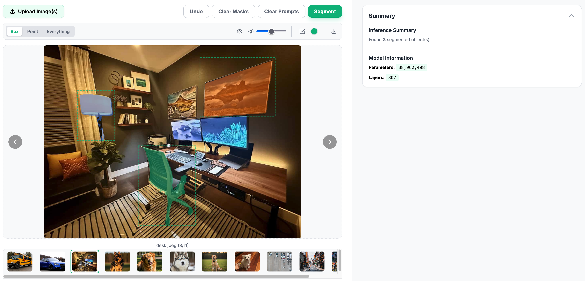

# Vision Toolkit

Tools for Computer Vision experiments.

## YOLO11

Web UI and inference server for Ultralytics' [YOLO11](https://docs.ultralytics.com/models/yolo11/) models in one Docker image running locally.


<details>
  <summary>Read more</summary>
You can check out the frontend clients via the links below. Note that this is just the frontend app and not connected to any backend.

- <https://hsuanhauliu.github.io/vision-toolkit/object_detection>
- <https://hsuanhauliu.github.io/vision-toolkit/image_classification>
- <https://hsuanhauliu.github.io/vision-toolkit/instance_segmentation>
- <https://hsuanhauliu.github.io/vision-toolkit/pose_estimation>

### Run

Place the saved model in ./data folder. You can use the provided script to download YOLO11. Modify the URL in the script if you want to use different yolo models.

You can also go to their [release page](https://github.com/ultralytics/assets/releases) on Github and download model from there directly.

```bash
./get_yolo_model.sh # this will download the file in ./data directory
```

Build Docker image.

```bash
# Build the image. Needs to be in the current directory.
docker build -t yolo11 -f models/yolo11/Dockerfile .

# You can override the task by passing in CLIENT build arg. Default is image classification.
# Note: oriented object detection and object detection shares the same client code, so use "object_detection" for this step if you are using oriented object detection.
docker build --build-arg CLIENT=object_detection -t yolo11 -f models/yolo11/Dockerfile .
```

Run Docker container.

Supported Yolo11 tasks:

- image_classification (default)
- object_detection
- oriented_object_detection
- instance_segmentation
- pose_estimation

```bash
# Frontend client will be running on http://localhost:8000. The default will build image classification docker image.
# Note: right now the clients are hardcoded to use port 8000. You can modify the index.html to change that.
docker run --rm -v ./data:/app/data --name yolo11 -p 8000:5000 yolo11

# You can override the model task and saved model file name using environment variable like so:
# Note: the backend will search for saved model file in ./data directory. Default model name is yolo_model.pt
docker run --rm -v ./data:/app/data --name yolo11 -p 8000:5000 -e YOLO_TASK=object_detection -e SAVED_MODEL=yolo_model.pt yolo11
```

</details>

## SAM2

Web UI and inference server for Ultralytics' [SAM2](https://docs.ultralytics.com/models/sam-2/) model in one Docker image running locally.



<details>
  <summary>Read more</summary>

### Run

  Use the following commands to build and run Docker. You can download the SAM2 models on their [release page](https://github.com/ultralytics/assets/releases/).

  Check out the client here: <https://hsuanhauliu.github.io/vision-toolkit/instance_segmentation/sam2.html>

  ```bash
  docker build -t sam2 -f models/sam2/Dockerfile .
  docker run --rm -v ./data:/app/data --name sam2 -p 8000:5000 -e SAVED_MODEL=sam2.1_t.pt sam2
  ```

</details>
